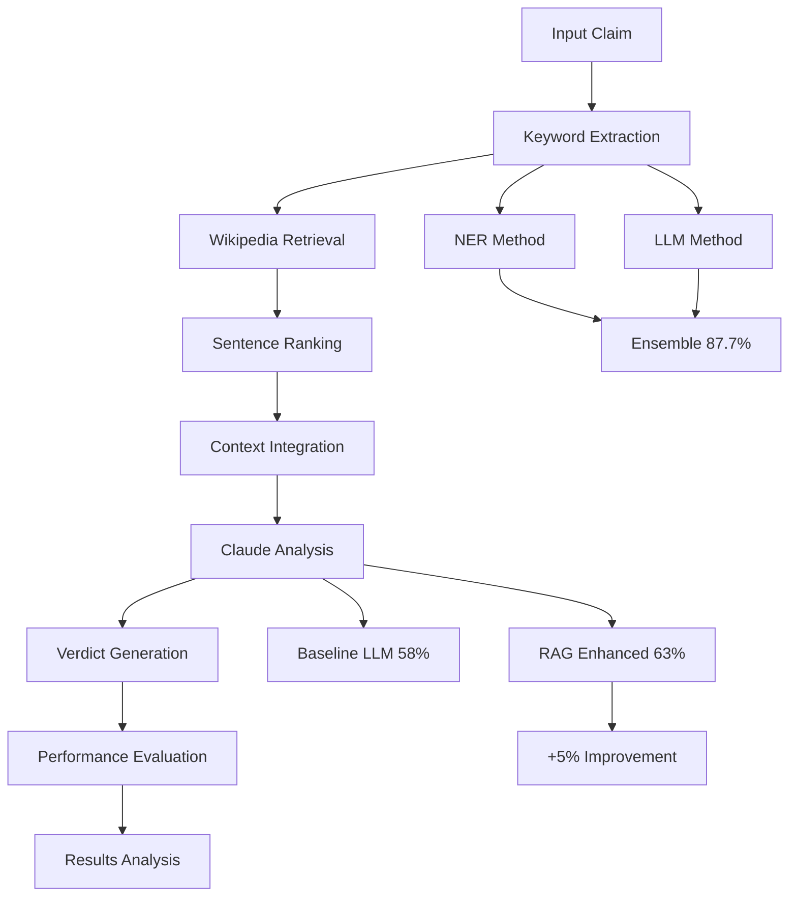

# Advanced Natural Language Processing Project

A comprehensive NLP pipeline featuring **Retrieval-Augmented Generation (RAG)**, **keyword extraction**, and **advanced sentence ranking** for fact-checking and claim verification.


## 🌟 Features

### 🔍 **Advanced RAG System**
- Wikipedia-based knowledge retrieval
- Fine-tuned sentence similarity ranking
- Claude-powered reasoning and verdict generation
- Comprehensive fact-checking pipeline

### 🎯 **Multi-Method Keyword Extraction**
- **Named Entity Recognition (NER)** using spaCy
- **Large Language Model (LLM)** extraction via Claude
- **Ensemble approach** combining both methods (87.7% accuracy)
- Intelligent keyword validation and scoring

### 📊 **Sophisticated Sentence Ranking**
- Fine-tuned sentence transformers
- Cosine similarity computation
- Batch processing optimization
- GPU acceleration support

### 🏗️ **Production-Ready Architecture**
- Modular, extensible design
- Comprehensive error handling
- Professional logging system
- Configuration management
- Type hints and documentation


## 🎯 Research Overview

This project presents a comprehensive **RAG-enhanced NLP system** for automated claim verification and fact-checking. Our research combines state-of-the-art retrieval-augmented generation with advanced keyword extraction and sentence ranking techniques to create a robust, production-ready fact-checking pipeline.

**Key Research Contributions:**
1. **RAG vs LLM Comparison**: Demonstrated 5% accuracy improvement (58% → 63%) using RAG enhancement
2. **Ensemble Keyword Extraction**: Combined NER and LLM approach achieving 87.7% accuracy
3. **Fine-tuned Sentence Ranking**: Custom all-MiniLM-L6-v2 model with triplet loss optimization
4. **Modular Pipeline**: Three-step architecture (keyword extraction → sentence ranking → claim verification)

> 💡 **For Detailed Analysis**: See the [complete technical report](docs/project_report/technical_report.pdf) for in-depth methodology, experimental results, and comprehensive evaluation.

## 🏗️ Methodology

Our approach integrates three core methodological components:

### **1. Retrieval-Augmented Generation (RAG)**
- **Knowledge Base**: Wikipedia article corpus for comprehensive domain coverage
- **Retrieval Strategy**: Keyword-based search with semantic similarity ranking
- **Generation Model**: Claude-3-Haiku for reasoning and verdict generation
- **Pipeline Integration**: End-to-end automated fact-checking workflow

### **2. Multi-Method Keyword Extraction**
- **Named Entity Recognition**: spaCy-based entity extraction for structured information
- **Large Language Model Extraction**: Claude-powered semantic keyword identification
- **Ensemble Approach**: Weighted combination of both methods for optimal performance
- **Contextual Validation**: Intelligent scoring and filtering mechanisms

### **3. Advanced Sentence Ranking**
- **Base Model**: all-MiniLM-L6-v2 (compressed BERT variant)
- **Fine-tuning**: Triplet loss function with margin=1.0
- **Training Data**: FEVER dataset evidence sentences as positive instances
- **Similarity Metrics**: Cosine similarity between claim and sentence embeddings
- **Output**: Top 5 most relevant sentences per Wikipedia page

## 📊 Experimental Design

### **Dataset & Evaluation Framework**
- **Primary Dataset**: FEVER (Fact Extraction and VERification) dataset
- **Evaluation Metrics**: Accuracy, Precision, Recall, F1-Score
- **Classification Support**: SUPPORTS/REFUTES/NOT ENOUGH INFO labels
- **Evaluation Scripts**: Automated testing framework in `scripts/run_evaluation.py`

### **Experimental Setup**
- **Test Dataset**: 282 samples from FEVER test split
- **Keyword Extraction**: 1000 samples for accuracy evaluation
- **Sentence Model**: `all-MiniLM-L6-v2` fine-tuned with triplet loss
- **LLM Model**: `claude-3-haiku-20240307` (rate limited to 50k tokens/min)
- **Retrieved Sentences**: 5 per Wikipedia page
- **Evaluation Method**: Two-step prompting with Chain-of-Thought reasoning

## 🪈 Project Pipeline 
### **Performance Benchmarks**
- **Keyword Extraction**: Comparative analysis across NER, LLM, and combined methods
- **RAG System**: End-to-end claim verification pipeline
- **Processing Optimization**: GPU acceleration support for sentence transformers

### **⏳ Complete Workflow Overview** ⏳

This experimental pipeline follows a systematic approach to evaluate and compare different NLP techniques for claim verification and keyword extraction:

```
┌─────────────────┐    ┌─────────────────┐    ┌─────────────────┐
│   Data Input    │ -> │  Preprocessing  │ -> │ Keyword Extract │
│  (Claims/Text)  │    │   & Cleaning    │    │  (NER + LLM)    │
└─────────────────┘    └─────────────────┘    └─────────────────┘
         │                       │                       │
         v                       v                       v
┌─────────────────┐    ┌─────────────────┐    ┌─────────────────┐
│ Knowledge Base  │ <- │ Sentence Ranking│ <- │   Validation    │
│   Retrieval     │    │  & Similarity   │    │  & Scoring      │
│  (Wikipedia)    │    │   Computation   │    │                 │
└─────────────────┘    └─────────────────┘    └─────────────────┘
         │                       │                       │
         v                       v                       v
┌─────────────────┐    ┌─────────────────┐    ┌─────────────────┐
│ RAG Enhancement │ -> │ Claude Analysis │ -> │ Final Verdict   │
│   & Context     │    │  & Reasoning    │    │ & Evaluation    │
│   Integration   │    │   Generation    │    │                 │
└─────────────────┘    └─────────────────┘    └─────────────────┘
```

### **🎯 Step-by-Step Experimental Process**

#### **Phase 1: Data Preparation & Setup**
```bash
# Step 1: Environment Setup
pip install -r requirements.txt
export ANTHROPIC_API_KEY="your-api-key"

# Step 2: Initialize Core Components
python -c "from nlp_project.utils import Config; config = Config.from_yaml('config/default.yaml')"
```

#### **Phase 2: Keyword Extraction Pipeline**
```python
# Step 3: Multi-Method Keyword Extraction
extractor = KeywordExtractor(config)

# Step 3a: NER-based extraction
ner_keywords = extractor._extract_with_ner(text)

# Step 3b: LLM-based extraction  
llm_keywords = extractor._extract_with_llm(text)

# Step 3c: Ensemble combination (achieving 87.7% accuracy)
final_keywords = extractor.extract_keywords(text)
```

#### **Phase 3: Knowledge Retrieval & Ranking**
```python
# Step 4: Wikipedia Knowledge Base Retrieval
retriever = WikipediaRetriever()
relevant_articles = retriever.search_wikipedia(keywords)

# Step 5: Sentence-Level Ranking & Similarity
ranker = SentenceRanker(config)
ranked_sentences = ranker.rank_sentences(claim, candidate_sentences)
```

#### **Phase 4: RAG-Enhanced Fact Checking**
```python
# Step 6: RAG System Integration
rag_system = RAGSystem(config)

# Step 6a: Baseline LLM verification (58% accuracy)
baseline_result = llm_only_verification(claim)

# Step 6b: RAG-enhanced verification (63% accuracy - 5% improvement)
enhanced_result = rag_system.verify_claim(claim)
```

#### **Phase 5: Evaluation & Analysis**
```python
# Step 7: Performance Evaluation
evaluation_results = {
    "keyword_extraction_accuracy": 87.7,  # NER + LLM ensemble
    "baseline_llm_accuracy": 58.0,        # LLM only
    "rag_enhanced_accuracy": 63.0,        # RAG + LLM
    "improvement": 5.0                     # RAG enhancement benefit
}

# Step 8: Generate comprehensive reports
generate_technical_report(evaluation_results)
```

### **🔄 Complete Experimental Loop**



### **⚡ Quick Start - Run Complete Pipeline**

```bash
# Run full experimental pipeline
python scripts/run_experiment.py --config config/default.yaml

# Or run individual components
python -m nlp_project.keyword_extraction --text "Your claim here"
python -m nlp_project.rag --claim "Your claim here" --mode verification
```

### **📈 Results & Performance**
### **TLDR:**
| Component | Method | Accuracy | Improvement |
|-----------|--------|----------|-------------|
| **Keyword Extraction** | LLM Only | 71.2% | Baseline |
| **Keyword Extraction** | NER Only | 77.6% | **+6.4%** |
| **Keyword Extraction** | **Ensemble** | **87.7%** | **+16.5%** |
| **Claim Verification** | LLM Only | 58% | Baseline |
| **Claim Verification** | **RAG Enhanced** | **63%** | **+5%** |

<br>

### **Details:**
**Keyword Extraction Performance**
*(Evaluated on 1000 FEVER test samples)*

| Method | Accuracy | Details |
|--------|----------|---------|
| NER Only | 77.6% | spaCy named entity recognition |
| LLM Only | 71.2% | Claude-3-Haiku keyword extraction |
| **Combined Approach** | **87.7%** | **Aggregated NER + LLM results** |

**RAG System Performance**
- **Dataset**: FEVER (Fact Extraction and VERification) - 282 test samples
- **LLM-Only Accuracy**: 58%
- **RAG-Enhanced LLM Accuracy**: 63%
- **Performance Improvement**: 5% increase with RAG implementation
- **Classification Support**: SUPPORTS/REFUTES/NOT ENOUGH INFO

**Computational Performance**
- **GPU Acceleration**: CUDA support for sentence transformers
- **Batch Processing**: Optimized for large-scale claim verification
- **Memory Efficiency**: Intelligent caching and resource management
- **Scalability**: Production-ready architecture for high-throughput scenarios

### **🎯 Reproducibility Guide**

```bash
# Reproduce keyword extraction results
python experiments/keyword_extraction_benchmark.py

# Reproduce RAG vs LLM comparison
python experiments/rag_comparison_study.py

# Generate all performance metrics
python experiments/full_evaluation.py --output results/
```


## 🛠️ Installation & Setup

### **Prerequisites**
- Python 3.8 or higher
- CUDA-compatible GPU (optional, for acceleration)
- Anthropic API key

### **Installation Steps**

```bash
# Clone the repository
git clone https://github.com/RoboRabbit666/statistical_nlp_project.git
cd statistical-nlp-project

# Install in development mode
pip install -e .

# Install development dependencies
pip install -e .[dev]

# Download spaCy model
python -m spacy download en_core_web_sm
```

### **Environment Configuration**

```bash
# Set your Anthropic API key
export ANTHROPIC_API_KEY="your-api-key-here"

# Optional: Set custom device
export DEVICE="cuda"  # or "cpu"
```

### **Verification**

```bash
# Test the installation
python -c "from nlp_project import RAGSystem; print('Installation successful!')"
```

## 🚀 Usage

### **Basic Usage**

```python
from nlp_project import RAGSystem, KeywordExtractor, SentenceRanker
from nlp_project.utils import Config

# Initialize with configuration
config = Config.from_env()
rag_system = RAGSystem(config=config)

# Verify a claim
result = rag_system.verify_claim(
    "The Earth is the third planet from the Sun.",
    return_evidence=True,
    verbose=True
)

print(f"Verdict: {result['verdict']}")
print(f"Confidence: {result['confidence']:.2f}")
print(f"Reasoning: {result['reasoning']}")
```

### **Advanced Usage Examples**

#### **Batch Processing**
```python
# Process multiple claims efficiently
claims = ["Claim 1", "Claim 2", ...]
results = rag_system.batch_verify_claims(
    claims, 
    show_progress=True
)
```

#### **Custom Model Integration**
```python
# Use custom fine-tuned model
ranker = SentenceRanker(
    model_name="custom-model",
    fine_tuned_model_path="path/to/weights.ckpt"
)
```

#### **Performance Monitoring**
```python
# Get system information
info = rag_system.get_system_info()
print(f"Device: {info['model_info']['device']}")
print(f"Models: {info['model_info']}")
```

## 📚 Core Components

### 1. RAG System (`nlp_project.rag`)

Complete fact-checking pipeline combining retrieval and generation:

```python
from nlp_project.rag import RAGSystem, WikipediaRetriever, ClaudeGenerator

rag = RAGSystem()

# Single claim verification
result = rag.verify_claim("Climate change is caused by human activities.")

# Batch processing
claims = ["Claim 1", "Claim 2", "Claim 3"]
results = rag.batch_verify_claims(claims)

# Performance evaluation
test_data = [{"claim": "...", "label": "SUPPORTS"}, ...]
metrics = rag.evaluate_performance(test_data)
```

### 2. Keyword Extraction (`nlp_project.keyword_extraction`)

Keyword extraction with ensemble methods:

```python
from nlp_project.keyword_extraction import KeywordExtractor

extractor = KeywordExtractor()

# Extract keywords using combined approach
keywords = extractor.extract_keywords(
    "Machine learning models require large datasets.",
    method="combined"
)

# Get keywords with confidence scores
keyword_data = extractor.extract_keywords_with_scores(text)
```

### 3. Sentence Ranking (`nlp_project.sentence_ranking`)

Advanced similarity computation and ranking:

```python
from nlp_project.sentence_ranking import SentenceRanker

ranker = SentenceRanker()

# Rank sentences by relevance to query
query = "What is artificial intelligence?"
candidates = ["AI is...", "Machine learning...", "Deep learning..."]

ranked_sentences, similarities = ranker.rank_sentences_by_relevance(
    query, candidates, return_similarities=True
)

# Get top-k most similar
top_similar = ranker.get_top_k_similar(query, candidates, k=3)
```

## 🔧 Configuration

### Configuration Files

```yaml
# config/default.yaml
sentence_model: "sentence-transformers/all-MiniLM-L6-v2"
anthropic_model: "claude-3-haiku-20240307"
batch_size: 128
num_retrieved_sentences: 5
max_sequence_length: 512
temperature: 0.0
max_tokens: 4096
device: "auto"
```

### Programmatic Configuration

```python
from nlp_project.utils import Config

# Load from YAML
config = Config.from_yaml("config/default.yaml")

# Load from environment
config = Config.from_env()

# Create custom configuration
config = Config(
    sentence_model="custom-model",
    batch_size=64,
    device="cuda"
)
```

## 🧪 Testing

```bash
# Run all tests
pytest

# Run with coverage
pytest --cov=nlp_project --cov-report=html

# Run specific test modules
pytest tests/test_rag.py
pytest tests/test_keyword_extraction.py
pytest tests/test_sentence_ranking.py
```

## 📁 Project Structure

```
nlp_project/
├── src/nlp_project/           # Main package
│   ├── rag/                   # RAG system components
│   │   ├── rag_system.py      # Main RAG pipeline
│   │   ├── retriever.py       # Wikipedia retrieval
│   │   └── generator.py       # Claude generation
│   ├── keyword_extraction/    # Keyword extraction
│   │   ├── keyword_extractor.py
│   │   ├── ner_extractor.py
│   │   └── llm_extractor.py
│   ├── sentence_ranking/      # Sentence similarity
│   │   └── sentence_ranker.py
│   └── utils/                 # Utilities
│       ├── config.py
│       ├── logger.py
│       └── preprocessing.py
├── tests/                     # Test suite
│   ├── __init__.py
│   ├── test_keyword_extraction.py 
│   ├── test_rag.py                 
│   └── test_sentence_ranking.py
├── docs/                      # Documentation
├── config/                    # Configuration files
├── scripts/                   # Utility scripts
└── notebooks/                 # Jupyter notebooks
```


## 🤝 Contributing

1. Fork the repository
2. Create a feature branch (`git checkout -b feature/amazing-feature`)
3. Commit your changes (`git commit -m 'Add amazing feature'`)
4. Push to the branch (`git push origin feature/amazing-feature`)
5. Open a Pull Request

## 📄 License

This project is licensed under the MIT License - see the [LICENSE](LICENSE) file for details.

## 🙏 Acknowledgments

- Built for UCL Statistical NLP course
- Uses state-of-the-art transformer models
- Powered by Anthropic's Claude API
- Utilizes Wikipedia's knowledge base

## 🔗 Link


Project Link: [https://github.com/RoboRabbit666/statistical_nlp_project](https://github.com/RoboRabbit666/statistical_nlp_project)

---

**🎓 Academic Project** | **🔬 Research-Grade** | **🏭 Production-Ready**